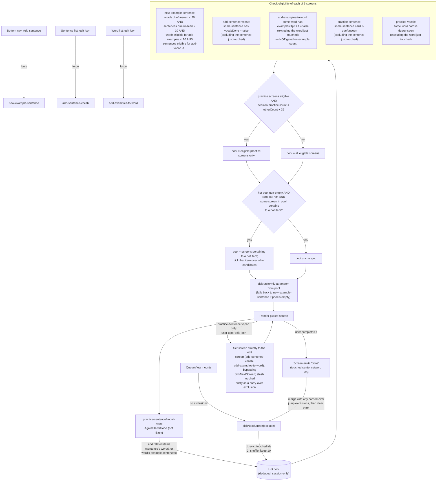

```mermaid
flowchart TD
    Mount["QueueView mounts"] -->|"no exclusions"| Pick
    Done["Screen emits 'done'\n(touched sentence/word ids)"] -->|"merge with any carried-over\njump exclusions, then clear them"| Pick

    Dock["Bottom nav: Add sentence"] -->|force| SNew["new-example-sentence"]
    SentEdit["Sentence list: edit icon"] -->|force| SVocab["add-sentence-vocab"]
    WordEdit["Word list: edit icon"] -->|force| SEx["add-examples-to-word"]

    Rate["practice-sentence/vocab rated\nAgain/Hard/Good (not Easy)"] -->|"add related items\n(sentence's words, or\nword's example sentences)"| HotPool[("Hot pool\n(deduped, session-only)")]

    Pick["pickNextScreen(exclude)"] -->|"1: evict touched ids\n2: shuffle, keep 10"| HotPool
    HotPool --> Elig

    subgraph Elig["Check eligibility of each of 5 screens"]
        direction TB
        E1["new-example-sentence:\nwords due/unseen < 20 AND\nsentences due/unseen < 10 AND\nwords eligible for add-examples < 10 AND\nsentences eligible for add-vocab < 5"]
        E2["add-sentence-vocab:\nsome sentence has vocabDone = false\n(excluding the sentence just touched)"]
        E3["add-examples-to-word:\nsome word has examplesOptOut = false\n(excluding the word just touched)\n— NOT gated on example count"]
        E4["practice-sentence:\nsome sentence card is due/unseen\n(excluding the sentence just touched)"]
        E5["practice-vocab:\nsome word card is due/unseen\n(excluding the word just touched)"]
    end

    Elig --> PoolCheck{"practice screens eligible AND\nsession practiceCount < otherCount + 3?"}
    PoolCheck -->|yes| PPool["pool = eligible practice screens only"]
    PoolCheck -->|no| FPool["pool = all eligible screens"]

    PPool --> HotCheck
    FPool --> HotCheck
    HotCheck{"hot pool non-empty AND\n50% roll hits AND\nsome screen in pool pertains\nto a hot item?"}
    HotCheck -->|yes| HPool["pool = screens pertaining to a hot item;\npick that item over other candidates"]
    HotCheck -->|no| Unchanged["pool unchanged"]

    HPool --> Rand["pick uniformly at random from pool\n(falls back to new-example-sentence if pool is empty)"]
    Unchanged --> Rand

    Rand --> Show["Render picked screen"]

    Show -->|"user completes it"| Done
    Show -->|"practice-sentence/vocab only:\nuser taps 'edit' icon"| Jump["Set screen directly to the edit\nscreen (add-sentence-vocab /\nadd-examples-to-word), bypassing\npickNextScreen; stash touched\nentity as a carry-over exclusion"]
    Jump --> Show
    Show --> Rate
```
